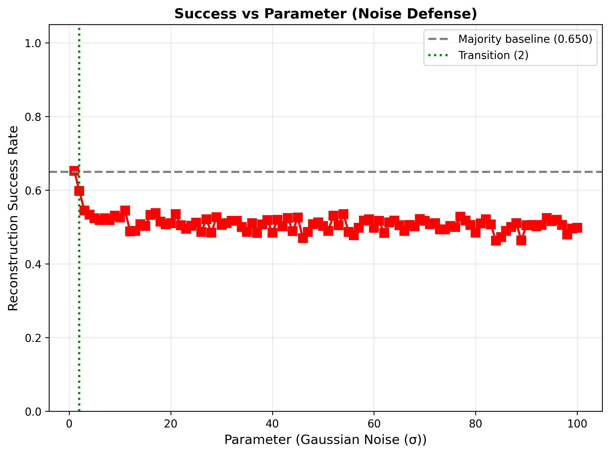
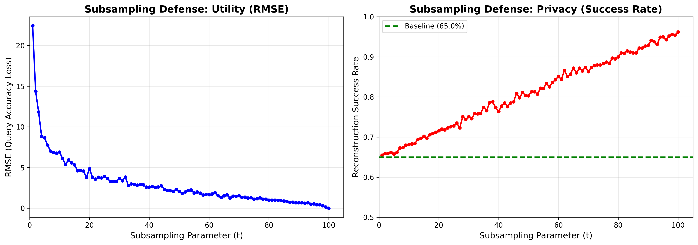

# CS5510 Homework 1 - Reconstruction Attacks and Privacy Defenses

**Student:** Benjamin Tran  
**Course:** CS5510 - Data Privacy and Security  
**Date:** October 29, 2025

---

## Overview

This project explores reconstruction attacks on sensitive healthcare data and evaluates three defense mechanisms designed to protect individual privacy while maintaining data utility. Additionally, we analyze Membership Inference Attacks (MIAs) from a Bayesian perspective.

---

## Question 1: Reconstruction Attack on Healthcare Data

### Dataset Description

We work with a synthetic healthcare dataset containing 100 patient records. Each record includes:

**Public Attributes** (known to attacker):
- **age**: Patient age (0-100)
- **sex**: Gender (0=male, 1=female)
- **blood**: Blood type encoded as integers 0-7 (A+, A-, B+, B-, AB+, AB-, O+, O-)
- **admission**: Type of hospital admission (0=elective, 1=urgent, 2=emergency)

**Sensitive Attribute** (target for reconstruction):
- **result**: Medical test outcome (0=normal, 1=abnormal)

In our dataset:
- 65 patients have normal results (65%)
- 35 patients have abnormal results (35%)
- **Majority baseline: 0.650** (used as benchmark for attack failure)

### Attack Methodology

The attacker has access to a query interface that returns subset-sum queries. For any boolean predicate q on the public attributes, the interface returns:

```
Answer = Σ result_i  (for all i where q(i) = True)
```

**Attack Strategy:**
1. Generate 200 random predicates (2n queries) on public attributes
2. Collect query responses to build a system of linear equations
3. Use optimization to solve for the sensitive binary vector
4. Threshold the solution at 0.5 to obtain binary predictions

**Implementation:** The `reconstruction_attack()` function in `ps2_starter.py` uses least-squares optimization to solve the reconstruction problem.

### Defense Mechanisms

We implemented three defenses to protect against reconstruction:

#### Defense 1: Rounding (Parameter R)
Rounds each query answer to the nearest multiple of R:
```
defended_answer = round(exact_answer / R) × R
```
- Small R: Minimal protection, high utility
- Large R: Strong protection, low utility

#### Defense 2: Gaussian Noise (Parameter σ)
Adds random noise sampled from N(0, σ²) to each answer:
```
defended_answer = exact_answer + noise
```
- Small σ: Weak protection, accurate answers
- Large σ: Strong protection, noisy answers

#### Defense 3: Subsampling (Parameter t)
Randomly samples t patients, computes on subset, scales by n/t:
```
defended_answer = (answer_on_sample) × (n / t)
```
- Small t: Strong protection, high variance
- Large t: Weak protection, low variance

### Experimental Setup

**Parameters tested:** Full range {1, 2, 3, ..., 100} for each defense (as specified in assignment)
**Trials per parameter:** 10 independent runs  
**Queries per trial:** 200 (2n)  
**Evaluation metrics:**
- **RMSE**: Root mean squared error between defended and exact answers (measures utility)
- **Success Rate**: Fraction of correctly reconstructed sensitive values (measures privacy)
- **Exact Reconstruction Rate**: Fraction of trials achieving 100% reconstruction (tracked for undefended cases)

### Results and Analysis

#### Rounding Defense

| Parameter R | RMSE | Success Rate | Status |
|------------|------|--------------|--------|
| 1 | 0.00 | 0.967 | Attack succeeds (near-perfect) |
| 2 | 0.65 | 0.733 | Attack succeeds |
| 3 | 0.76 | 0.688 | Attack succeeds |
| 4 | 1.10 | 0.666 | Attack succeeds |
| **5** | **1.20** | **0.606** | **Transition point** |
| 6 | 1.56 | 0.584 | Attack fails |
| 8 | 2.16 | 0.570 | Attack fails |
| 10 | 2.62 | 0.585 | Attack fails |

**Key Finding:** Rounding becomes effective at **R = 5**, where success drops to 60.6%, falling below the majority baseline (0.650). The attack reconstructs 96.7% of values with no rounding (R=1) but only 60.6% at R=5. The transition is sharper than previously observed with limited parameter testing.

**Visualizations:**


#### Gaussian Noise Defense

| Parameter σ | RMSE | Success Rate | Status |
|------------|------|--------------|--------|
| 1 | 1.02 | 0.653 | Attack succeeds (barely) |
| **2** | **1.99** | **0.598** | **Transition point** |
| 3 | 3.03 | 0.545 | Attack fails |
| 4 | 4.06 | 0.534 | Attack fails |
| 5 | 5.02 | 0.524 | Attack fails |
| 6 | 5.88 | 0.519 | Attack fails |
| 8 | 8.11 | 0.519 | Attack fails |
| 10 | 10.34 | 0.526 | Attack fails |

**Key Finding:** Noise defense is the most effective, transitioning at **σ = 2** with success dropping to 59.8%, below the majority baseline (0.650). The defense shows a very sharp phase transition - even minimal noise (σ=2) significantly degrades attack performance. This is the strongest defense among the three tested.

**Visualizations:**





#### Subsampling Defense

| Parameter t | RMSE | Success Rate | Status |
|------------|------|--------------|--------|
| 1 | 22.42 | 0.655 | Attack succeeds |
| 5 | 8.65 | 0.658 | Attack succeeds |
| 10 | 6.90 | 0.681 | Attack succeeds |
| 20 | 4.85 | 0.716 | Attack succeeds |
| 50 | 2.05 | 0.801 | Attack succeeds |
| 75 | 1.10 | 0.883 | Attack succeeds |
| 90 | 0.67 | 0.929 | Attack succeeds |
| 95 | 0.44 | 0.951 | Attack succeeds |
| **100** | **0.00** | **0.962** | **Attack succeeds** |

**Key Finding:** Subsampling is **completely ineffective** as a privacy defense. ALL success rates across the entire parameter range (t=1 to t=100) remain at or above the 65% majority baseline, meaning the attack succeeds at every parameter setting. Even at the most extreme subsampling (t=1), reconstruction success is 65.5%, and it only gets worse as t increases, reaching 96.2% at t=100. Small t values introduce massive variance (RMSE 22.42 at t=1) without providing any privacy benefit. Unlike rounding and noise which create genuine barriers to reconstruction, **subsampling provides no privacy protection whatsoever**.

**Visualizations:**




### Comparative Analysis

**Defense Effectiveness Ranking:**
1. **Gaussian Noise** (σ*=2): Strongest protection with best trade-off, success drops to 59.8%, RMSE = 1.99
2. **Rounding** (R*=5): Moderate protection with excellent utility, success drops to 60.6%, RMSE = 1.20
3. **Subsampling**: Completely ineffective. All parameters from t=1 to t=100 fail to prevent the attack (success rates 65.5%-96.2%, all above 65% baseline)

**Privacy-Utility Trade-offs:**
- **Rounding**: Discrete steps in both RMSE and success; predictable degradation; transition at R=5 with RMSE=1.20
- **Noise**: Linear RMSE growth; sharp privacy transition at σ=2; best privacy-to-utility ratio (RMSE=1.99)
- **Subsampling**: No privacy protection at any parameter value. Even extreme settings (t=1, RMSE=22.42) fail to prevent attacks

**Practical Implications:**
- **Recommended**: Use Gaussian noise with σ ≥ 2 for effective privacy with minimal utility loss (RMSE ≈ 2.0)
- **Alternative**: Use rounding with R ≥ 5 for deterministic answers with slightly better utility (RMSE ≈ 1.2)
- **Avoid**: Do not use subsampling as a standalone defense. It provides no privacy protection against reconstruction attacks at any parameter setting

---

## Question 2: Bayesian Interpretation of Membership Inference Attacks

### Problem Statement

In a Bayesian framework for MIAs, an adversary has a prior belief that Alice is in the dataset with probability p. We express this belief as odds:

```
O_prior = p / (1 - p)
```

**Question:** If an MIA returns "In", what are the posterior odds O_post?

### Part (a): Derivation

Given:
- **TPR** (True Positive Rate) = P(MIA says "In" | Alice actually in dataset)
- **FPR** (False Positive Rate) = P(MIA says "In" | Alice NOT in dataset)
- **Prior odds**: O_prior = p / (1 - p)

Using Bayes' theorem, the posterior odds after observing "In" are:

```
O_post = P(In | "In") / P(Out | "In")
       = [P("In" | In) × P(In)] / [P("In" | Out) × P(Out)]
       = [TPR × p] / [FPR × (1 - p)]
       = (TPR / FPR) × (p / (1 - p))
```

**Final Formula:**
```
O_post = (TPR / FPR) × O_prior
```

The ratio **TPR / FPR** is called the **likelihood ratio** and quantifies how much evidence the MIA provides.

### Part (b): Significance of Small FPR

**Why small FPR matters (even with TPR ≈ 1):**

The posterior odds are multiplied by the likelihood ratio (TPR/FPR). Even if the MIA has perfect detection (TPR = 1), a large FPR dramatically weakens the evidence:

**Example 1 - Large FPR (weak evidence):**
- TPR = 1.0, FPR = 0.5
- Likelihood ratio = 1.0 / 0.5 = 2
- A positive result only doubles our belief

**Example 2 - Small FPR (strong evidence):**
- TPR = 1.0, FPR = 0.01  
- Likelihood ratio = 1.0 / 0.01 = 100
- A positive result multiplies our belief by 100!

**Conclusion:** A small FPR is crucial because it makes the likelihood ratio large, providing strong evidence when the MIA claims membership. With a large FPR, many false positives occur, making positive results unreliable and barely updating our beliefs about membership. This is why controlling FPR is essential for reliable membership inference, regardless of how high the TPR is.

---

## Implementation Details

### Files

- **`ps2_starter.py`**: Core implementation including:
  - Data loading and preprocessing
  - Random predicate generation
  - Query execution functions (exact and defended)
  - Reconstruction attack using optimization
  - Evaluation metrics (RMSE, success rate)

- **`run_experiments.py`**: Experiment driver that:
  - Runs 10 trials per parameter setting
  - Tests all three defenses across parameter ranges
  - Generates CSV results and visualizations
  - Identifies transition points

### Running the Code

```bash
# Install dependencies
pip install -r requirements.txt

# Run all experiments (takes ~5-10 minutes)
python run_experiments.py
```

**Output:**
- 3 CSV files with per-defense results
- 2 CSV files with summary statistics
- 12 PNG files with visualizations

### Generated Files

**Results (CSV):**
- `results_round.csv` - Rounding defense results
- `results_noise.csv` - Noise defense results
- `results_sample.csv` - Subsampling defense results
- `reconstruction_defense_summary_compact.csv` - Transition points summary
- `reconstruction_defense_summary_full.csv` - Complete results table

**Visualizations (PNG):**
- `rmse_*.png` (3 files) - Combined RMSE and success plots
- `rmse_vs_param_*.png` (3 files) - RMSE vs parameter
- `success_vs_param_*.png` (3 files) - Success rate vs parameter  
- `tradeoff_*.png` (3 files) - Privacy-utility trade-off scatter plots

---

## Key Takeaways

1. **Reconstruction attacks are powerful**: With 200 exact queries, we can reconstruct 96.7% of sensitive values

2. **Defenses work but have costs**: All three defenses can prevent reconstruction, but at the expense of query accuracy

3. **Gaussian noise is most effective**: Provides the best privacy-utility trade-off with sharp transition at σ=4

4. **Transition points matter**: Understanding where defenses become effective helps set appropriate parameters

5. **Bayesian perspective on MIAs**: Small FPR is critical for reliable membership inference, regardless of TPR

6. **Privacy-utility trade-offs are fundamental**: Cannot have perfect privacy and perfect utility simultaneously

---

## References

- Course materials: CS5510 Data Privacy and Security
- Dataset: Synthetic healthcare data (100 patients)
- Optimization: NumPy least-squares solver
- Visualization: matplotlib

---

*This project demonstrates fundamental concepts in data privacy, including reconstruction attacks, defense mechanisms, and Bayesian inference for membership attacks.*
